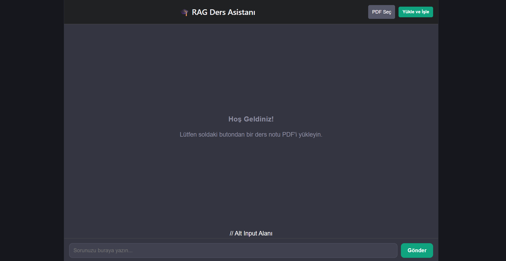

# 🤖 RAG-Based PDF Chatbot Assistant

Bu proje; kullanıcıların sisteme yükledikleri PDF dokümanlarını anlamsal olarak analiz eden ve doküman içeriği hakkında bağlam farkındalığına sahip (**context-aware**) yanıtlar üreten uçtan uca (**Full-Stack**) bir **Retrieval-Augmented Generation (RAG)** asistanıdır. Gelişmiş vektör arama mimarisi sayesinde yapay zeka modelinin halüsinasyon görmesini engeller ve doğrudan dokümandaki verilere sadık kalır.

---

## 🖥️ Uygulama Arayüzü (UI)

<p align="center">
  
</p>

---

## 🏗️ Sistem Mimarisi ve RAG Veri Akışı
Proje, modern yapay zeka mühendisliği standartlarına uygun olarak şu veri işleme hattını (Pipeline) işletmektedir:

1. **Document Ingestion (Veri Girişi):** Kullanıcı arayüz üzerinden PDF dosyasını yükler. Backend mimarisi metni parse eder.
2. **Text Chunking (Metin Parçalama):** Ayıklanan uzun metinler, anlamsal bütünlüğü korumak amacıyla belirli karakter sınırlarında küçük parçalara (chunks) ayrılır.
3. **Vector Embeddings (Vektör Dönüşümü):** Her bir metin parçası, anlamsal vektör uzayına taşınmak üzere yüksek boyutlu vektörlere dönüştürülür.
4. **Vector Database (Vektör Depolama):** Üretilen vektörler, hızlı benzerlik araması (Similarity Search) yapılabilmesi için bir Vektör Veri Tabanında indekslenir.
5. **Retrieval & Generation (Sorgu ve Yanıt):** Kullanıcı chatbot'a soru sorduğunda, sorunun vektörü ile veri tabanındaki metin vektörleri arasında benzerlik araması yapılır. En ilgili bağlam (context) ayıklanarak LLM'e gönderilir ve kesin, doğru bir yanıt üretilir.

---

## 🛠️ Kullanılan Teknolojiler ve Framework'ler

### Backend & AI Ekosistemi
- **Python 3.x**
- **LangChain / LlamaIndex** (RAG Orkestrasyonu ve Pipeline Yönetimi)
- **FastAPI / Flask** (Asenkron REST API Servisleri)
- **Vector DB:** ChromaDB / FAISS / Pinecone
- **LLM & Embeddings:** OpenAI GPT / HuggingFace / Ollama

### Frontend
- **HTML5, CSS3, JavaScript** (React / Vite Framework)
- **Fetch API / Axios** (Asenkron API haberleşmesi ve gerçek zamanlı Log akışı yönetimi)

---

## 🔧 Kurulum ve Çalıştırma

### 1. Arka Plan (Backend) Kurulumu
1. Terminalde projenin ana dizinindeyken sanal ortamı aktif edin:
   * **Windows:** `.\venv\Scripts\activate`
   * **Mac/Linux:** `source venv/bin/activate`
2. Gerekli kütüphaneleri kontrol edin/yükleyin:
   ```bash
   pip install fastapi uvicorn langchain chromaDB pypdf

Arka plan servisini başlatın:
```bash
uvicorn backend.main:app --reload
```
2. Arayüz (Frontend) Kurulumu
Yeni bir terminal sekmesi açın ve frontend klasörüne geçiş yapın:

```bash
cd frontend
```
Gerekli Node.js paketlerini yükleyin:

```bash
npm install
```
Arayüz uygulamasını canlı geliştirme modunda başlatın:
```bash
npm run dev
```
💡 Bu proje; büyük dil modellerinin (LLM) kurumsal veya özel dokümanlarla özelleştirilmesi, vektör veritabanı optimizasyonları ve uçtan uca AI tabanlı web uygulamaları geliştirme süreçlerini deneyimlemek amacıyla modellenmiştir.
